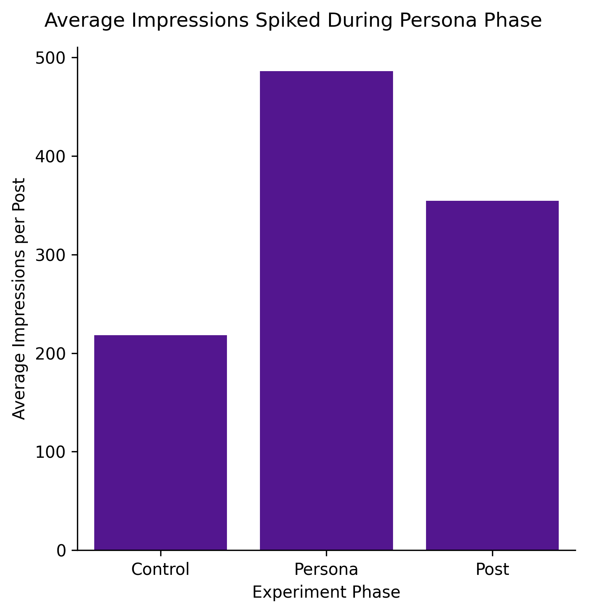
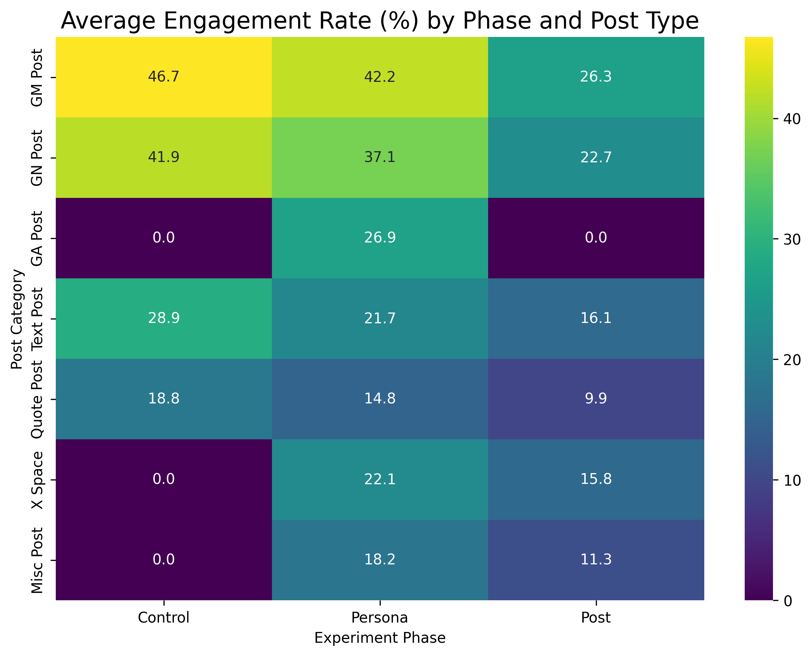

# The Aiasuka Effect: A Case Study on Gender Bias in Web3

**An independent quantitative study that deployed an AI-generated female persona on X (Twitter) to measure its impact on user engagement and follower growth within the Web3 community, revealing significant algorithmic and gender bias.**

---

## Context

Synthetic influencers and AI-generated personas are increasingly common on social platforms, often without disclosure requirements. This experiment examines how these personas exploit algorithmic bias and gender dynamics, with implications for authentic creators (particularly women), platform policy, and online trust.

### Hypothesis
*An AI-generated feminine persona will significantly increase engagement and follower growth through parasocial attraction and gender bias. Reverting to an authentic male identity will reveal the fragility of these bonds, highlighting perceived gender’s dominance over authentic identity.*

### Methodology
* Conducted a 3-week, 3-phase (Control, Persona, Post-Persona) experiment on a live X account.
* Deployed "Aiasuka," an AI-generated female persona with a unique visual and tonal identity, for a 7-day period.
* Collected and cleaned engagement data (impressions, likes, replies, bookmarks) from over 129 posts to create a unified dataset for analysis.

### Key Findings

* The synthetic "Persona" phase generated a massive, statistically significant increase in impressions (+47%) and drove over 700 new followers, accounting for 60% of the total growth during the experiment.
* Statistical validation using t-tests and ANOVA confirmed that while impressions soared, the engagement *quality* was highest in the authentic "Control" phase, and the drop in engagement after the reveal was statistically significant.
* The study uncovered critical ethical implications, highlighting how synthetic personas can displace authentic voices and how algorithms can amplify this bias.

### Technical Stack
* **Data Analysis:** Python, Pandas, NumPy, SciPy
* **Data Visualization:** Matplotlib, Seaborn
* **Environment:** Google Colab

---

### How To View
To see the full code and step-by-step analysis, please open the `Aiasuka_Effect_Notebook.ipynb` file in this repository.
